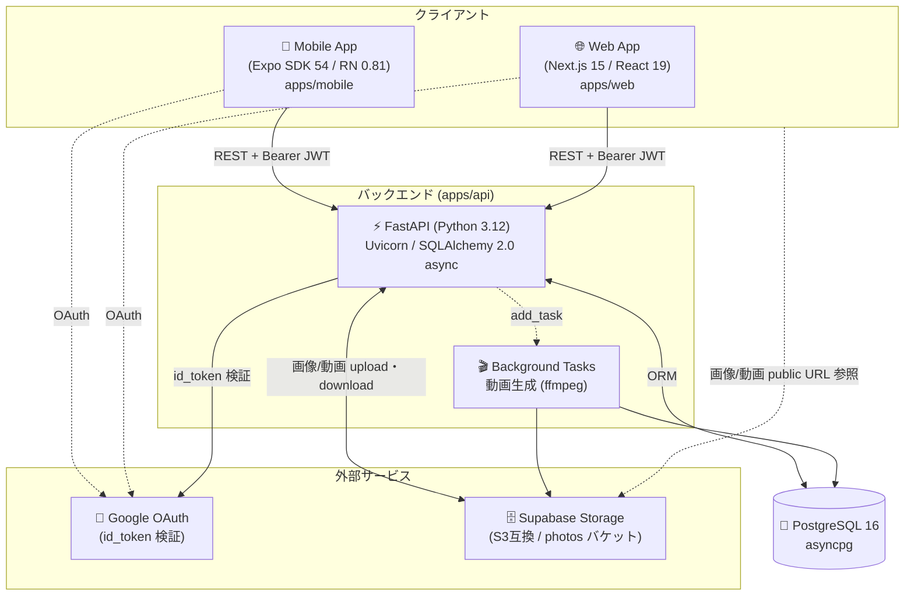
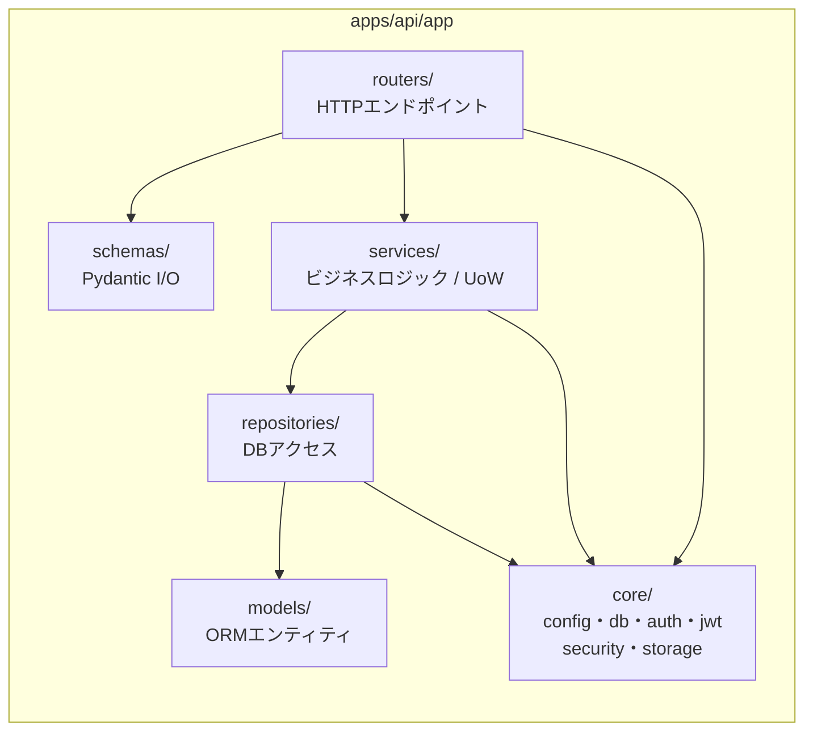
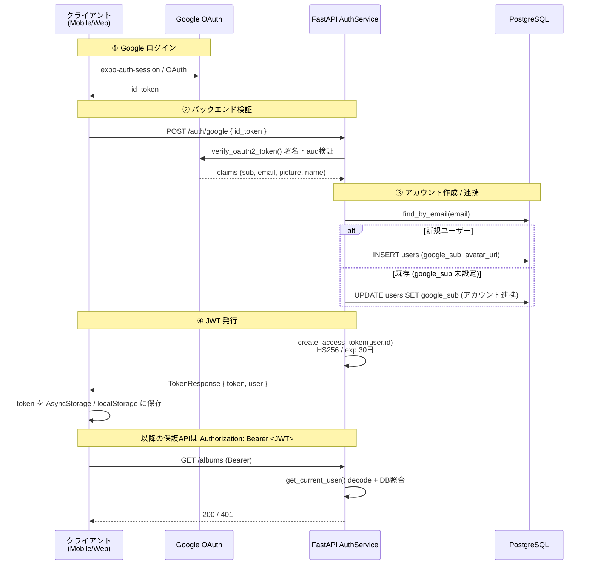
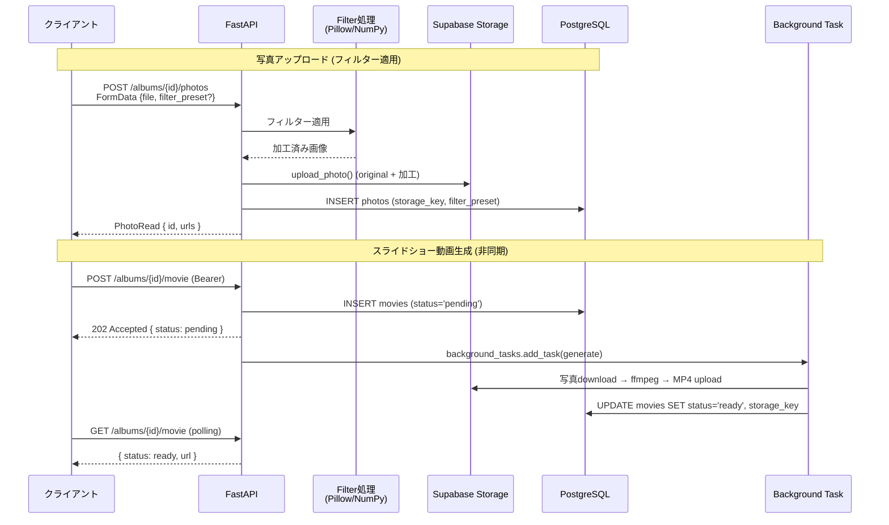
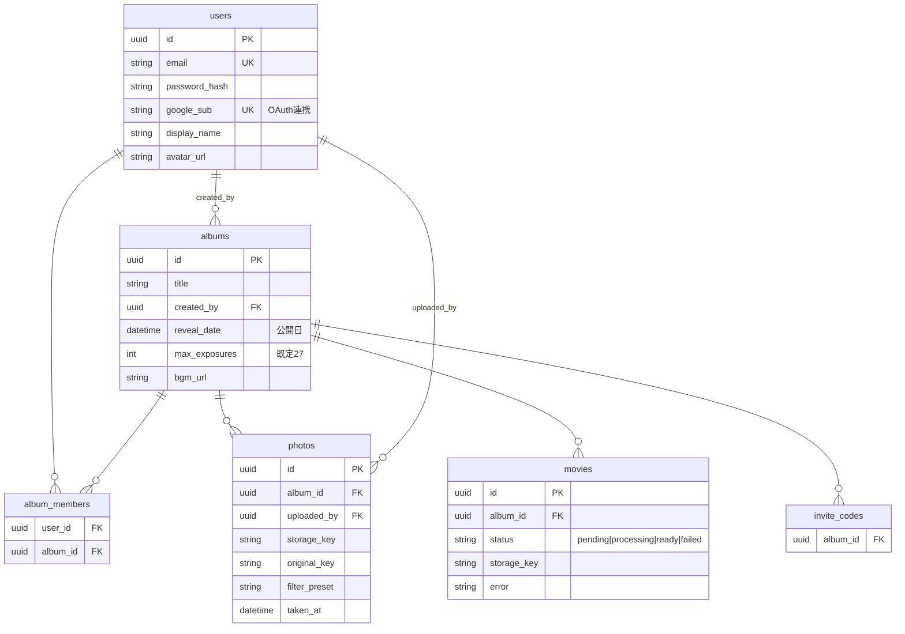

# 変ルンです (Kawarun Desu) — アーキテクチャ図

タイムロック型の写真アルバムアプリ。指定した「公開日」まで写真を見られず、レトロフィルターやスライドショー動画生成を備える。

---

## 1. システム全体構成



---

## 2. バックエンド レイヤー構成 (4層)



| 主要ルーター | 役割 | 認証 |
|---|---|---|
| `/health` | ヘルスチェック | 不要 |
| `/auth/{register,login,google}` | ユーザー認証・JWT発行 | 不要 |
| `/albums` | アルバムCRUD | 必要 |
| `/albums/{id}/photos` | 写真一覧・アップロード | 必要 |
| `/albums/{id}/movie` | スライドショー動画生成 (202非同期) | 必要 |
| `/filters` | フィルタープリセット一覧 | — |

---

## 3. 認証フロー (Google OAuth + JWT) — `feat/google-login-jwt`



メール+パスワード認証 (bcrypt ハッシュ) も併用可能。`/auth/login` で同様に JWT を発行。

---

## 4. 主要データフロー: 写真アップロード & 動画生成



---

## 5. データモデル (ER)



---

## 6. 技術スタック

| 領域 | 技術 | 配置 |
|---|---|---|
| Mobile | Expo SDK 54 / React Native 0.81 / React 19 | `apps/mobile` |
| Web | Next.js 15 (App Router) / React 19 | `apps/web` |
| Backend | FastAPI 0.115 / Uvicorn / Python 3.12 | `apps/api` |
| ORM / DB | SQLAlchemy 2.0 async / asyncpg / PostgreSQL 16 | `apps/api` |
| 認証 | PyJWT (HS256) / google-auth | `core/jwt.py`, `services/auth.py` |
| 画像処理 | Pillow / NumPy (HEIC/HEIF対応) | `services/photo.py` |
| ストレージ | Supabase Storage (S3互換) | `core/storage.py` |
| Monorepo | pnpm 10.5 workspaces / Node 22+ | root |
| インフラ | Docker Compose (dev) / Render (prod) | `docker-compose.yml`, `render.yaml` |
| CI/CD | GitHub Actions (lint/typecheck/test/build) | `.github/workflows/ci.yml` |
```
